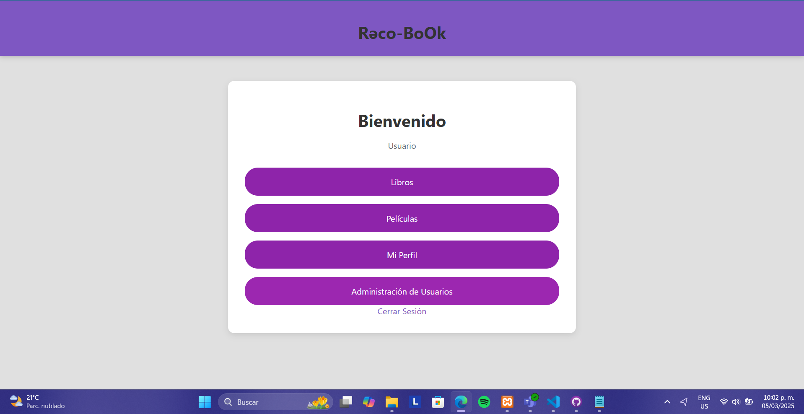
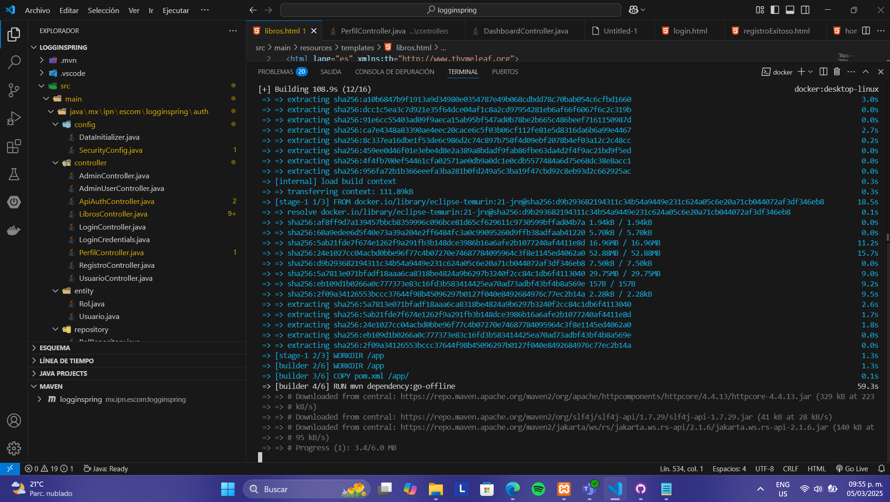

# Proyecto Logginspring

Este es un proyecto que permite simular un loggin, sistema de roles y ademas las funciones de un CRUD utilizando Spring Boot. El propósito de este proyecto es emular un sistema de recomendacion de libros.

## Capturas de Pantalla

Aquí se muestran algunas capturas de pantalla del proyecto primero parte de la inicalizacion y programacion de funciones.


## Evidencias de Simulaciones o pruebas

Aquí la verdad den cierto momento me atore y como es muy dificil estar checando la terminal para ver donde esta a falla acudi a postman.


### Bases de datos

Realemnete entre cada intento termine creando muchos conflictos con otras bases jeje, pero aqui acturas del xampp.


### Finalmente capturas de las vistas generadas por el proyecto

No crei necesario añadir las vistas de diseños previos ya que si eso fuera, nunca acabamos, pero aqui estan las vistas.





## Evidencia de dockerizacion


1. Clona este repositorio:
   ```bash
   git clone https://github.com/tuusuario/logginspring.git
