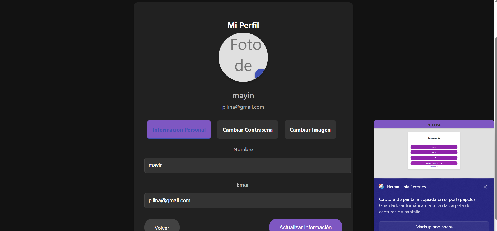

# Proyecto Logginspring

Este es un proyecto que permite simular un loggin, sistema de roles y ademas las funciones de un CRUD utilizando Spring Boot. El propósito de este proyecto es emular un sistema de recomendacion de libros.

## Capturas de Pantalla

Aquí se muestran algunas capturas de pantalla del proyecto, primero parte de la inicalizacion y programacion de funciones.


## Evidencias de Simulaciones o pruebas

Aquí la verdad en cierto momento me atore y como es muy dificil estar checando la terminal para ver donde esta a falla acudi a postman.


### Bases de datos

Realmente entre cada intento termine creando muchos conflictos con otras bases jeje, pero aqui estan las capturas del xampp.


### Finalmente capturas de las vistas generadas por el proyecto

No crei necesario añadir las vistas de diseños previos ya que si eso fuera, nunca acabamos, pero aqui estan las vistas.


### Se añaden correciones y funciones extra
Empezamos con la implementacion de un boron que nos permite cambiar entre tema claro y tema oscuro


Ademas de corregir fallas como la imposibiladad para subir imagenes de perfil
se tuvo que cambiar en el controlador de perfil la manera en la que se interpretaba la imagen



Tambien se arreglan fallas en el administrador, ya que el controlador de adminuser, no guardaba correctamente
los roles en database provocando multiples dificultades, ahora se puede modificar y gestionar los roles sin
problemas


Finamente se muestra la funcion de reecomendacion funcionando 


## Evidencia de dockerizacion


## Evidencia de pruebas con MySQL Workbench


## IMPORTANTE: iniciar sesion con usuario "admin" y contraseña "admin" para ver interfaz de administrador

1. Clona este repositorio:
   ```bash
   git clone https://github.com/tuusuario/logginspring.git
